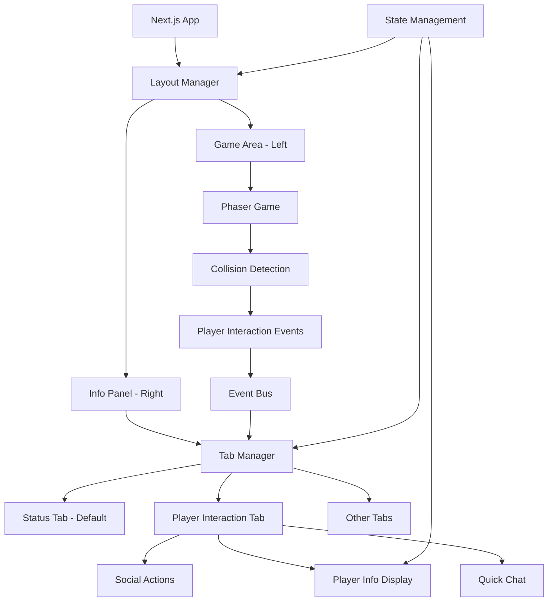

# Design Document

## Overview

本设计文档描述了基于碰撞检测的玩家交互系统的技术实现方案。该系统将重新设计界面布局，从当前的左右布局调整为左游戏右信息的布局，并在右侧信息面板中实现标签页形式的交互界面。当玩家发生碰撞时，系统将自动切换到玩家交互标签页，提供实时的社交功能。

## Architecture

### 系统架构图



### 核心组件关系

1. **Layout Manager**: 管理整体布局切换和响应式设计
2. **Tab Manager**: 管理右侧面板的标签页切换逻辑
3. **Collision Detection System**: 增强现有的碰撞检测，添加交互触发
4. **Player Interaction Panel**: 新的玩家交互界面组件
5. **Event Bus**: 处理Phaser游戏与React组件间的通信

## Components and Interfaces

### 1. Layout Manager Component

```typescript
interface LayoutManagerProps {
  gameComponent: React.ReactNode
  infoPanel: React.ReactNode
  isMobile: boolean
}

interface LayoutState {
  currentLayout: 'desktop' | 'mobile'
  gameAreaWidth: string
  infoPanelWidth: string
}
```

**职责:**
- 管理桌面端和移动端的布局切换
- 处理响应式设计逻辑
- 控制游戏区域和信息面板的尺寸比例

### 2. Tab Manager Component

```typescript
interface TabManagerProps {
  activeTab: TabType
  onTabChange: (tab: TabType) => void
  collisionPlayer: PlayerData | null
}

interface TabType {
  id: string
  label: string
  icon: string
  component: React.ComponentType
  badge?: number
}

interface TabState {
  tabs: TabType[]
  activeTabId: string
  animationState: 'idle' | 'switching'
}
```

**职责:**
- 管理标签页的注册和切换
- 处理标签页间的动画过渡
- 提供标签页状态的视觉反馈（徽章、高亮等）

### 3. Enhanced Collision Detection

```typescript
interface CollisionEvent {
  type: 'collision_start' | 'collision_end'
  mainPlayer: PlayerData
  targetPlayer: PlayerData
  timestamp: number
  position: { x: number; y: number }
}

interface CollisionManager {
  onCollisionStart: (event: CollisionEvent) => void
  onCollisionEnd: (event: CollisionEvent) => void
  getCurrentCollisions: () => PlayerData[]
  setCollisionSensitivity: (radius: number) => void
}
```

**增强功能:**
- 扩展现有的碰撞检测系统
- 添加碰撞开始和结束事件
- 支持多玩家同时碰撞的处理
- 提供碰撞敏感度配置

### 4. Player Interaction Panel Component

```typescript
interface PlayerInteractionPanelProps {
  player: PlayerData
  onSendMessage: (message: string) => void
  onFollow: (playerId: string) => void
  onViewProfile: (playerId: string) => void
}

interface PlayerData {
  id: string
  name: string
  avatar: string
  currentStatus: StatusData
  isOnline: boolean
  lastSeen?: string
}

interface StatusData {
  type: string
  status: string
  emoji: string
  message: string
  timestamp: string
}
```

**功能模块:**
- 玩家基本信息展示
- 快速聊天界面
- 社交操作按钮（关注、查看详情等）
- 实时状态更新

### 5. Event Bus System

```typescript
interface EventBus {
  emit: (event: string, data: any) => void
  on: (event: string, callback: (data: any) => void) => void
  off: (event: string, callback: (data: any) => void) => void
}

// 事件类型定义
interface GameEvents {
  'player:collision:start': CollisionEvent
  'player:collision:end': CollisionEvent
  'player:click': PlayerClickEvent
  'tab:switch': TabSwitchEvent
  'chat:message:send': ChatMessageEvent
}
```

## Data Models

### 1. Layout Configuration

```typescript
interface LayoutConfig {
  desktop: {
    gameArea: {
      width: string // "calc(100% - 400px)"
      height: string // "100vh"
    }
    infoPanel: {
      width: string // "400px"
      height: string // "100vh"
      position: 'left' | 'right' // "right"
    }
  }
  mobile: {
    gameArea: {
      width: string // "100%"
      height: string // "60vh"
    }
    infoPanel: {
      width: string // "100%"
      height: string // "40vh"
      position: 'top' | 'bottom' // "bottom"
    }
  }
}
```

### 2. Tab Configuration

```typescript
interface TabConfig {
  id: string
  label: string
  icon: string
  component: string
  defaultActive: boolean
  showBadge: boolean
  autoSwitch: boolean // 是否支持自动切换
  priority: number // 优先级，用于多个标签同时激活时的选择
}

interface TabRegistry {
  tabs: Map<string, TabConfig>
  activeTab: string
  switchHistory: string[]
}
```

### 3. Player Interaction State

```typescript
interface PlayerInteractionState {
  currentPlayer: PlayerData | null
  collisionHistory: CollisionEvent[]
  chatMessages: ChatMessage[]
  socialActions: SocialAction[]
  interactionMode: 'collision' | 'click' | 'manual'
}

interface ChatMessage {
  id: string
  senderId: string
  receiverId: string
  content: string
  timestamp: string
  type: 'text' | 'emoji' | 'system'
}

interface SocialAction {
  id: string
  type: 'follow' | 'unfollow' | 'block' | 'report'
  targetUserId: string
  timestamp: string
  status: 'pending' | 'completed' | 'failed'
}
```

## Error Handling

### 1. 碰撞检测错误处理

```typescript
interface CollisionErrorHandler {
  handleDetectionFailure: (error: Error) => void
  handleEventLoss: (missedEvents: CollisionEvent[]) => void
  handlePerformanceIssue: (metrics: PerformanceMetrics) => void
}
```

**错误场景:**
- 碰撞检测性能问题
- 事件丢失或重复
- 玩家数据同步失败

### 2. 界面切换错误处理

```typescript
interface LayoutErrorHandler {
  handleResizeFailure: (error: Error) => void
  handleTabSwitchFailure: (fromTab: string, toTab: string, error: Error) => void
  handleComponentLoadFailure: (componentName: string, error: Error) => void
}
```

**错误场景:**
- 响应式布局失败
- 标签页组件加载失败
- 动画执行错误

### 3. 通信错误处理

```typescript
interface CommunicationErrorHandler {
  handleEventBusFailure: (event: string, error: Error) => void
  handlePhaserReactSyncFailure: (error: Error) => void
  handleStateUpdateFailure: (stateKey: string, error: Error) => void
}
```

## Testing Strategy

### 1. 单元测试

**Layout Manager Tests:**
```typescript
describe('LayoutManager', () => {
  test('should switch to mobile layout on small screens', () => {})
  test('should maintain aspect ratio on resize', () => {})
  test('should preserve game state during layout switch', () => {})
})
```

**Tab Manager Tests:**
```typescript
describe('TabManager', () => {
  test('should switch tabs with animation', () => {})
  test('should auto-switch on collision events', () => {})
  test('should handle multiple simultaneous tab requests', () => {})
})
```

**Collision Detection Tests:**
```typescript
describe('CollisionDetection', () => {
  test('should detect player collision accurately', () => {})
  test('should handle multiple simultaneous collisions', () => {})
  test('should debounce rapid collision events', () => {})
})
```

### 2. 集成测试

**Phaser-React Integration:**
```typescript
describe('PhaserReactIntegration', () => {
  test('should sync collision events from Phaser to React', () => {})
  test('should maintain performance during heavy interaction', () => {})
  test('should handle game restart without breaking React state', () => {})
})
```

**End-to-End User Flow:**
```typescript
describe('UserInteractionFlow', () => {
  test('should complete full collision-to-chat workflow', () => {})
  test('should handle layout switch during interaction', () => {})
  test('should preserve interaction state across page refresh', () => {})
})
```

### 3. 性能测试

**Performance Benchmarks:**
```typescript
describe('Performance', () => {
  test('should maintain 60fps during collision detection', () => {})
  test('should handle 50+ simultaneous players', () => {})
  test('should complete tab switch in <200ms', () => {})
})
```

## Implementation Phases

### Phase 1: Layout Restructure (Week 1)
- 实现新的布局管理器
- 调整现有组件以适应新布局
- 添加响应式设计支持
- 保持现有功能完全兼容

### Phase 2: Tab System (Week 2)
- 创建标签页管理系统
- 实现标签页切换动画
- 迁移现有信息面板到标签页形式
- 添加标签页状态管理

### Phase 3: Enhanced Collision Detection (Week 3)
- 扩展现有碰撞检测系统
- 添加碰撞事件的详细信息
- 实现防抖和性能优化
- 添加多玩家碰撞处理

### Phase 4: Player Interaction Panel (Week 4)
- 创建新的玩家交互界面
- 实现快速聊天功能
- 添加社交操作按钮
- 集成实时状态更新

### Phase 5: Integration & Polish (Week 5)
- 完整的事件流集成测试
- 性能优化和错误处理
- 用户体验细节优化
- 文档和测试完善

## Technical Considerations

### 1. 性能优化

**碰撞检测优化:**
- 使用空间分区算法减少检测计算量
- 实现碰撞事件的防抖机制
- 添加可视范围外玩家的检测暂停

**界面渲染优化:**
- 使用React.memo优化组件重渲染
- 实现虚拟滚动处理大量聊天消息
- 添加标签页内容的懒加载

### 2. 兼容性考虑

**现有功能保持:**
- 保留原有的点击交互作为备选
- 维持现有的状态管理逻辑
- 确保现有API接口不受影响

**渐进式升级:**
- 支持新旧布局的平滑切换
- 提供功能开关控制新特性
- 添加降级方案处理不支持的浏览器

### 3. 扩展性设计

**插件化架构:**
- 标签页系统支持动态注册新标签
- 碰撞检测支持自定义事件处理器
- 社交功能支持第三方集成

**配置化管理:**
- 布局参数可通过配置文件调整
- 碰撞检测敏感度可动态配置
- 标签页顺序和显示可自定义