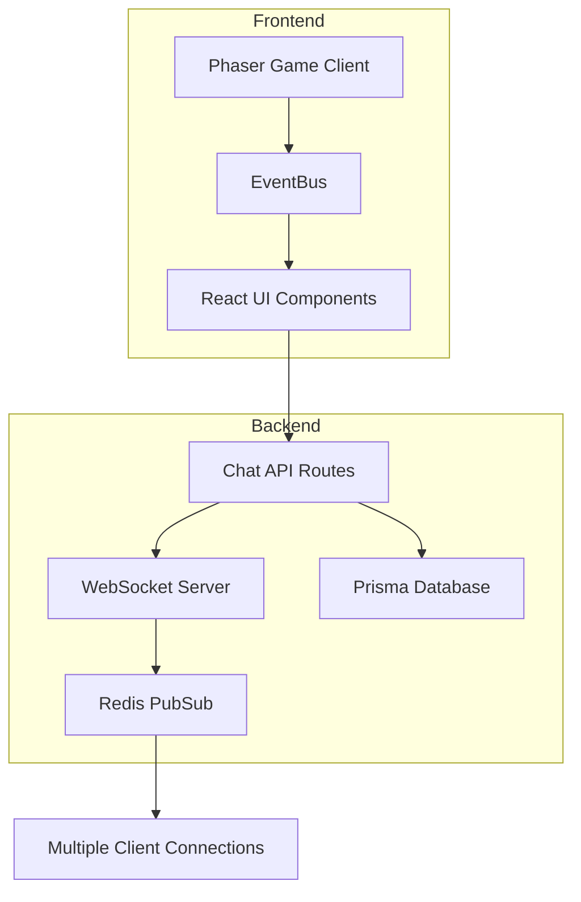

# Design Document

## Overview

The real-time chat system enables seamless communication between users in the PixelDesk virtual office environment. The system leverages WebSocket connections for real-time messaging, integrates with the existing Prisma database for message persistence, and maintains consistency with the current UI design patterns. The architecture supports private messaging, message notifications, online status tracking, and conversation management while ensuring scalability and performance.

## Architecture

### System Components



### Technology Stack

- **Frontend**: React, TypeScript, Tailwind CSS, Phaser 3
- **Backend**: Next.js API Routes, WebSocket (ws library)
- **Database**: PostgreSQL with Prisma ORM
- **Real-time**: WebSocket connections with Redis for scaling
- **Event System**: Existing EventBus for Phaser-React communication

### Data Flow

1. **Message Sending**: User types message → React component → WebSocket → Server → Database + Broadcast
2. **Message Receiving**: Server → WebSocket → Client → EventBus → UI Update
3. **Notifications**: New message → Notification system → Visual indicators → User interaction

## Components and Interfaces

### Database Models

```prisma
// New models to add to schema.prisma

model Conversation {
  id            String   @id @default(cuid())
  type          String   @default("private") // private, group
  name          String?  // For group conversations
  createdAt     DateTime @default(now())
  updatedAt     DateTime @updatedAt
  
  participants  ConversationParticipant[]
  messages      Message[]
  
  @@map("conversations")
}

model ConversationParticipant {
  id             String   @id @default(cuid())
  conversationId String
  userId         String
  joinedAt       DateTime @default(now())
  lastReadAt     DateTime @default(now())
  isActive       Boolean  @default(true)
  
  conversation   Conversation @relation(fields: [conversationId], references: [id], onDelete: Cascade)
  user          User         @relation(fields: [userId], references: [id], onDelete: Cascade)
  
  @@unique([conversationId, userId])
  @@map("conversation_participants")
}

model Message {
  id             String   @id @default(cuid())
  conversationId String
  senderId       String
  content        String
  type           String   @default("text") // text, emoji, system, image
  status         String   @default("sent") // sent, delivered, read
  createdAt      DateTime @default(now())
  updatedAt      DateTime @updatedAt
  
  conversation   Conversation @relation(fields: [conversationId], references: [id], onDelete: Cascade)
  sender        User         @relation(fields: [senderId], references: [id], onDelete: Cascade)
  
  @@index([conversationId, createdAt])
  @@map("messages")
}

model UserOnlineStatus {
  id           String   @id @default(cuid())
  userId       String   @unique
  isOnline     Boolean  @default(false)
  lastSeen     DateTime @default(now())
  socketId     String?  // Current WebSocket connection ID
  updatedAt    DateTime @updatedAt
  
  user User @relation(fields: [userId], references: [id], onDelete: Cascade)
  
  @@map("user_online_status")
}
```

### API Endpoints

#### REST API Routes

```typescript
// /api/chat/conversations
GET    - Get user's conversations with unread counts
POST   - Create new conversation
PUT    - Update conversation (name, participants)
DELETE - Leave/delete conversation

// /api/chat/conversations/[id]/messages
GET    - Get conversation messages (with pagination)
POST   - Send new message
PUT    - Mark messages as read

// /api/chat/users/online-status
GET    - Get online status of users
POST   - Update user's online status

// /api/chat/notifications
GET    - Get unread message notifications
POST   - Mark notifications as read
```

#### WebSocket Events

```typescript
// Client to Server
interface ClientEvents {
  'join_room': { conversationId: string }
  'leave_room': { conversationId: string }
  'send_message': { conversationId: string, content: string, type: string }
  'typing_start': { conversationId: string }
  'typing_stop': { conversationId: string }
  'mark_read': { conversationId: string, messageId: string }
}

// Server to Client
interface ServerEvents {
  'message_received': { message: Message, conversation: Conversation }
  'message_status_updated': { messageId: string, status: string }
  'user_typing': { userId: string, conversationId: string }
  'user_online': { userId: string, isOnline: boolean }
  'conversation_updated': { conversation: Conversation }
}
```

### React Components

#### ChatManager Component
```typescript
interface ChatManagerProps {
  currentUserId: string
  isVisible: boolean
  onToggle: () => void
}

// Main chat interface manager
// - Handles multiple conversation windows
// - Manages notification state
// - Coordinates with EventBus
```

#### ConversationWindow Component
```typescript
interface ConversationWindowProps {
  conversation: Conversation
  currentUserId: string
  onClose: () => void
  onMinimize: () => void
  position: { x: number, y: number }
}

// Individual chat window
// - Message display and input
// - Typing indicators
// - Message status indicators
// - Drag and resize functionality
```

#### ChatNotificationPanel Component
```typescript
interface ChatNotificationPanelProps {
  notifications: ChatNotification[]
  onNotificationClick: (conversationId: string) => void
  onMarkAllRead: () => void
}

// Notification center for chat messages
// - Unread message indicators
// - Quick preview of messages
// - Integration with existing tab system
```

#### MessageBubble Component
```typescript
interface MessageBubbleProps {
  message: Message
  isOwn: boolean
  showAvatar: boolean
  showTimestamp: boolean
}

// Individual message display
// - Consistent with existing UI design
// - Status indicators (sent/delivered/read)
// - Timestamp formatting
// - Message type handling (text/emoji/system)
```

### EventBus Integration

#### New Event Types
```typescript
// Add to existing GameEvents interface
interface GameEvents {
  // ... existing events
  'chat:conversation:opened': { conversationId: string, participant: PlayerData }
  'chat:message:received': { message: Message, conversationId: string }
  'chat:notification:new': { count: number, latestMessage: Message }
  'chat:user:typing': { userId: string, conversationId: string, isTyping: boolean }
  'chat:user:online': { userId: string, isOnline: boolean }
}
```

## Data Models

### Core Data Structures

```typescript
interface ChatMessage {
  id: string
  conversationId: string
  senderId: string
  senderName: string
  senderAvatar?: string
  content: string
  type: 'text' | 'emoji' | 'system' | 'image'
  status: 'sending' | 'sent' | 'delivered' | 'read' | 'failed'
  timestamp: string
  createdAt: string
  updatedAt: string
}

interface ChatConversation {
  id: string
  type: 'private' | 'group'
  name?: string
  participants: ConversationParticipant[]
  lastMessage?: ChatMessage
  unreadCount: number
  isActive: boolean
  createdAt: string
  updatedAt: string
}

interface ConversationParticipant {
  id: string
  userId: string
  userName: string
  userAvatar?: string
  isOnline: boolean
  lastSeen?: string
  joinedAt: string
  lastReadAt: string
  isActive: boolean
}

interface ChatNotification {
  id: string
  conversationId: string
  messageId: string
  senderId: string
  senderName: string
  content: string
  timestamp: string
  isRead: boolean
}

interface TypingIndicator {
  userId: string
  userName: string
  conversationId: string
  timestamp: number
}
```

## Error Handling

### Client-Side Error Handling

```typescript
interface ChatError {
  type: 'connection' | 'send_failed' | 'load_failed' | 'permission_denied'
  message: string
  conversationId?: string
  messageId?: string
  retryable: boolean
}

// Error handling strategies:
// 1. Connection errors: Auto-reconnect with exponential backoff
// 2. Send failures: Queue messages for retry
// 3. Load failures: Show error state with retry button
// 4. Permission errors: Show appropriate user feedback
```

### Server-Side Error Handling

```typescript
// WebSocket error responses
interface ErrorResponse {
  error: true
  type: string
  message: string
  code: number
  retryable: boolean
}

// Database error handling
// - Connection pool management
// - Transaction rollback on failures
// - Graceful degradation for non-critical features
```

## Testing Strategy

### Unit Tests
- Message formatting and validation
- Conversation state management
- Notification logic
- EventBus integration

### Integration Tests
- WebSocket connection handling
- Database operations
- API endpoint functionality
- Real-time message delivery

### End-to-End Tests
- Complete chat flow between two users
- Notification system functionality
- Multiple conversation management
- Cross-browser compatibility

### Performance Tests
- Message throughput under load
- WebSocket connection scaling
- Database query optimization
- Memory usage monitoring

## Security Considerations

### Authentication & Authorization
- JWT token validation for WebSocket connections
- User permission checks for conversation access
- Rate limiting for message sending
- Input sanitization and validation

### Data Protection
- Message content encryption in transit
- Secure WebSocket connections (WSS)
- SQL injection prevention
- XSS protection for message content

### Privacy Controls
- User blocking functionality
- Conversation privacy settings
- Message deletion capabilities
- Online status privacy options

## Performance Optimization

### Client-Side Optimization
- Message virtualization for large conversations
- Lazy loading of conversation history
- Debounced typing indicators
- Efficient re-rendering with React.memo

### Server-Side Optimization
- Database connection pooling
- Message pagination and caching
- Redis for WebSocket scaling
- Efficient database queries with proper indexing

### Real-Time Optimization
- WebSocket connection management
- Message batching for high-frequency updates
- Heartbeat mechanism for connection health
- Graceful fallback to polling if WebSocket fails

## Scalability Architecture

### Horizontal Scaling
- Multiple WebSocket server instances
- Redis pub/sub for cross-server communication
- Load balancer for WebSocket connections
- Database read replicas for message history

### Caching Strategy
- Redis for active conversations
- Browser cache for message history
- CDN for user avatars and media
- In-memory cache for online status

## Integration Points

### Existing System Integration
- EventBus for Phaser game events
- Current user authentication system
- Existing UI design system and components
- Database schema extension (not replacement)

### Future Extension Points
- File sharing capabilities
- Voice/video calling integration
- Bot and automation support
- Mobile app compatibility